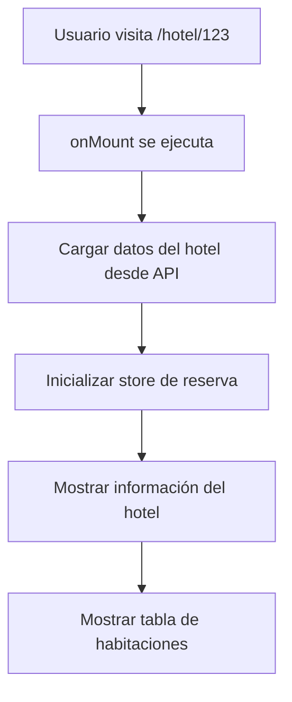
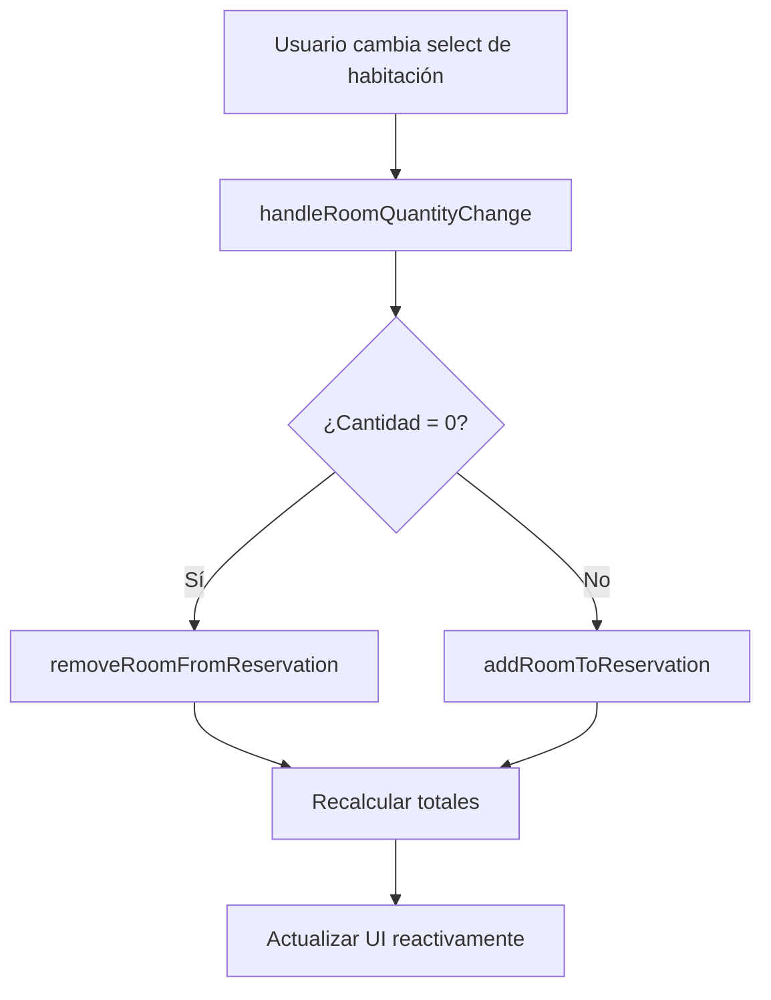
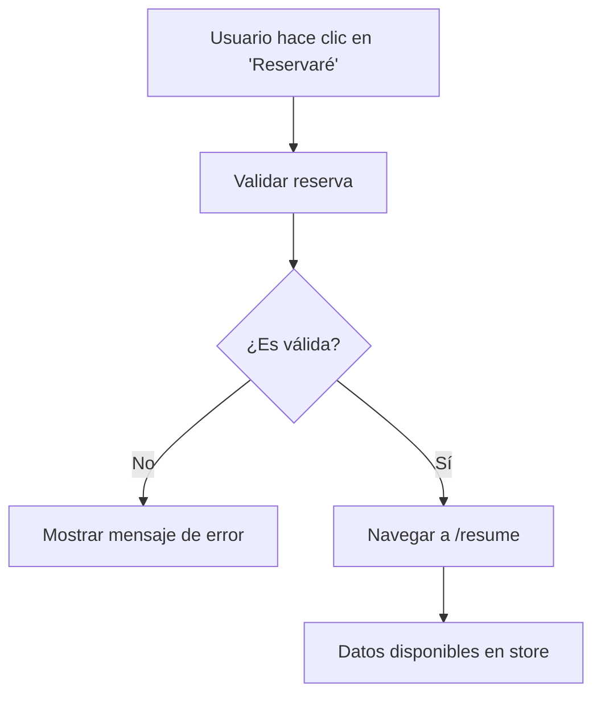

# Sistema de Reservas - Documentación Técnica

## 📋 Resumen Ejecutivo

El sistema de reservas implementado permite a los usuarios seleccionar habitaciones de hotel, calcular totales en tiempo real y navegar hacia el proceso de pago con toda la información necesaria almacenada en un store centralizado.

## 🏗️ Arquitectura del Sistema

### Componentes Principales

```
src/
├── lib/
│   ├── stores/
│   │   ├── reservation.ts          # Store principal de reservas
│   │   ├── hotelDetails.ts         # Store de datos del hotel
│   │   └── hotelReviews.ts         # Store de reviews
│   ├── services/
│   │   └── hotelDetailsService.ts  # Servicio de API del hotel
│   └── components/
│       └── common/
│           └── DateGuestPicker.svelte # Selector de fechas/huéspedes
└── routes/
    ├── hotel/[hotel_id]/+page.svelte # Página principal del hotel
    └── resume/+page.svelte           # Página de resumen de reserva
```

## 🗄️ Store de Reservas (`reservation.ts`)

### Estructura de Datos

```typescript
interface ReservationData {
  hotel: {
    // Información básica del hotel
    id: number;
    name: string;
    address: string;
    rating: number;
    // ... más campos
    
    // Datos completos de la API (para evitar nuevas peticiones)
    hotelDetails: HotelDetails | null;
    hotelPhotos: HotelPhoto[] | null;
    hotelDescription: HotelDescription | null;
    roomList: RoomListResponse | null;
  };
  
  searchParams: {
    checkInDate: string;
    checkOutDate: string;
    adults: number;
    children: number;
    rooms: number;
    pets: boolean;
  };
  
  selectedRooms: SelectedRoom[];
  totals: {
    subtotal: number;
    taxes: number;
    total: number;
    currency: string;
  };
  
  isValid: boolean;
  lastUpdated: string;
}
```

### Habitación Seleccionada

```typescript
interface SelectedRoom {
  roomId: number;
  roomType: string;
  roomName: string;
  quantity: number;
  pricePerNight: number;
  totalNights: number;
  subtotal: number;
  taxes: number;
  total: number;
  options: {
    breakfast: boolean;
    cancellation: boolean;
    prepayment: boolean;
    refundableUntil?: string;
    mealplan?: string;
  };
  roomData: any; // Datos completos de la API
}
```

## 🔧 Funcionalidades Principales

### 1. Inicialización de Reserva

```typescript
reservationStore.initializeReservation(
  hotelDetails,      // Datos completos del hotel
  hotelPhotos,       // Fotos del hotel
  hotelDescription,  // Descripción del hotel
  roomList,          // Lista de habitaciones disponibles
  searchParams       // Parámetros de búsqueda
);
```

**Propósito**: Carga todos los datos del hotel en el store para evitar nuevas peticiones en páginas siguientes.

### 2. Selección de Habitaciones

```typescript
reservationStore.addRoomToReservation(roomData, quantity);
reservationStore.removeRoomFromReservation(roomId);
reservationStore.updateRoomQuantity(roomId, quantity);
```

**Características**:
- ✅ Soporte para múltiples habitaciones
- ✅ Cálculo automático de totales
- ✅ Validación de disponibilidad
- ✅ Recálculo de impuestos y totales

### 3. Cálculo de Totales

```typescript
function calculateTotals(selectedRooms: SelectedRoom[], currency: string) {
  const subtotal = selectedRooms.reduce((sum, room) => sum + room.subtotal, 0);
  const taxes = selectedRooms.reduce((sum, room) => sum + room.taxes, 0);
  const total = subtotal + taxes;
  
  return { subtotal, taxes, total, currency };
}
```

**Fórmula de cálculo**:
- **Subtotal**: `precio_por_noche × noches × cantidad`
- **Impuestos**: `(precio_gross - precio_net) × noches × cantidad`
- **Total**: `subtotal + impuestos`

## 🎯 Flujo de Usuario

### 1. Carga de Página de Hotel



### 2. Selección de Habitaciones



### 3. Navegación a Resumen



## 🔄 Reactividad del Sistema

### Variables Reactivas en la Página

```typescript
// Variables reactivas principales
$: reservationData = $reservationStore;
$: selectedRooms = $reservationStore.selectedRooms;
$: reservationTotals = $reservationStore.totals;
$: isReservationValid = $reservationStore.isValid;

// Resumen reactivo que se actualiza automáticamente
$: reservationSummary = (() => {
  if (selectedRooms.length === 0) {
    return {
      hasSelection: false,
      text: '• Todavía no se te cobrará nada'
    };
  }
  
  const totalRooms = selectedRooms.reduce((sum, room) => sum + room.quantity, 0);
  const totalNights = selectedRooms[0]?.totalNights || 0;
  const totalAmount = reservationTotals.total;
  
  return {
    hasSelection: true,
    text: `• ${totalRooms} habitación${totalRooms > 1 ? 'es' : ''} • ${totalNights} noche${totalNights > 1 ? 's' : ''} • ${totalAmount.toLocaleString('es-CO', { style: 'currency', currency: 'COP' })}`
  };
})();
```

## 🎨 Interfaz de Usuario

### Ubicaciones del Resumen

El resumen de la reserva aparece en **3 lugares** de la página:

1. **Header del hotel** (debajo del botón "Reserva ahora")
2. **Panel lateral** (debajo del botón "Reserva ahora" del panel)
3. **Tabla de habitaciones** (debajo del botón "Reservaré")

### Estados del Resumen

```typescript
// Sin selección
"• Todavía no se te cobrará nada"

// Con selección
"• 2 habitaciones • 1 noche • $489.300 COP"
```

### Validación de Botones

```typescript
// Botón habilitado solo si hay habitaciones seleccionadas
<button 
  disabled={!isReservationValid}
  on:click={navigateToResume}
>
  {isReservationValid ? 'Reservaré' : 'Selecciona habitaciones'}
</button>
```

## 🔗 Integración con DateGuestPicker

### Eventos Personalizados

```typescript
// En DateGuestPicker.svelte
const dispatch = createEventDispatcher();

function handleApplyChanges() {
  dispatch('dataChange', {
    checkInDate,
    checkOutDate,
    adults,
    children,
    rooms,
    pets
  });
}
```

### Manejo en Página de Hotel

```typescript
// En hotel/[hotel_id]/+page.svelte
function handleDateGuestChange(newData: any) {
  // Actualizar parámetros de búsqueda
  reservationStore.updateSearchParams(newData);
  
  // Recargar datos del hotel con nuevos parámetros
  const hotelId = parseInt($page.params.hotel_id);
  if (hotelId) {
    HotelDetailsService.loadHotelData(
      hotelId, 
      newData.checkInDate, 
      newData.checkOutDate, 
      newData.adults, 
      newData.children
    ).then(hotelData => {
      if (hotelData.hotelDetails) {
        reservationStore.initializeReservation(
          hotelData.hotelDetails,
          hotelData.hotelPhotos,
          hotelData.hotelDescription,
          hotelData.roomList,
          newData
        );
      }
    });
  }
}
```

## 🐛 Debug y Logging

### Logs Implementados

```typescript
// En reservation.ts
console.log('🏨 Agregando habitación a reserva:', { roomData, quantity });
console.log('🔍 Índice de habitación existente:', existingRoomIndex);
console.log('💰 Totales calculados:', totals);
console.log('🏨 Habitaciones seleccionadas:', newSelectedRooms);

// En hotel/[hotel_id]/+page.svelte
console.log('🔄 Cambiando cantidad de habitación:', { roomData, quantity });
```

## 📊 Beneficios del Sistema

### 1. **Performance**
- ✅ **Sin nuevas peticiones** en páginas siguientes
- ✅ **Datos completos** almacenados en el store
- ✅ **Cálculos en memoria** para totales

### 2. **Experiencia de Usuario**
- ✅ **Feedback en tiempo real** de selecciones
- ✅ **Validación inmediata** de reservas
- ✅ **Información consistente** en toda la página

### 3. **Mantenibilidad**
- ✅ **Separación de responsabilidades** clara
- ✅ **Store centralizado** para estado de reserva
- ✅ **Funciones reutilizables** para cálculos

### 4. **Escalabilidad**
- ✅ **Fácil extensión** para nuevas funcionalidades
- ✅ **Estructura modular** de componentes
- ✅ **API consistente** del store

## 🚀 Próximos Pasos

### Funcionalidades Futuras

1. **Persistencia en localStorage** para mantener reserva entre sesiones
2. **Validación de disponibilidad** en tiempo real
3. **Descuentos y promociones** automáticas
4. **Integración con sistema de pagos**
5. **Confirmación por email** de reservas

### Optimizaciones

1. **Lazy loading** de imágenes de habitaciones
2. **Caché inteligente** de datos de hotel
3. **Compresión** de datos en el store
4. **Métricas** de performance del sistema

## 🔧 Configuración y Uso

### Instalación

No requiere instalación adicional. El sistema está integrado en el proyecto Svelte existente.

### Uso Básico

```typescript
// Importar el store
import { reservationStore } from '$lib/stores/reservation';

// Suscribirse a cambios
$: reservationData = $reservationStore;

// Agregar habitación
reservationStore.addRoomToReservation(roomData, 2);

// Obtener resumen
const summary = reservationStore.getReservationSummary();
```

### Variables de Entorno

No requiere variables de entorno adicionales. Utiliza la configuración existente de la API de Booking.com.

---

**Desarrollado por**: Sistema de Reservas v1.0  
**Última actualización**: Diciembre 2024  
**Tecnologías**: Svelte, TypeScript, Svelte Stores
